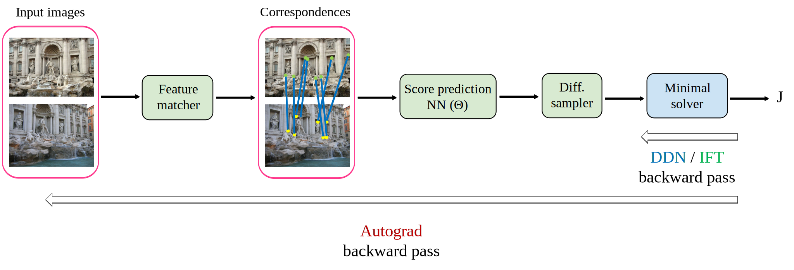

# MinBackProp – Backpropagating through Minimal Solvers

Source code for the paper [MinBackProp – Backpropagating through Minimal Solvers](https://arxiv.org/abs/2404.17993)

  

  

 

## TODO
The source code and the trained models will be released soon.
