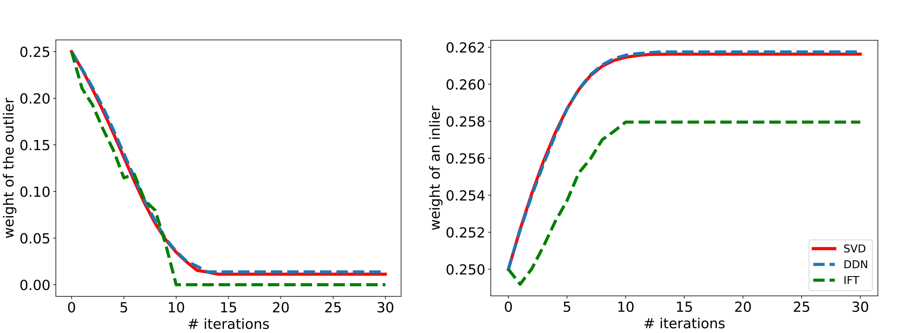

<p align="center">
  
</p>

## Requirements
For our experiments, we used the versions of Python and PyTorch
```
python = 3.11.3	
pytorch = 2.0.0
```

## 3D Point Registration with an Outlier
To start optimization run
```bash
python estimate_rotation.py --ift --ddn --autograd --plot
```
graphs will be saved in the ```results/rotation``` directory.

Formulas for IFT calculated with ```R_4p.mw``` and Maple software.

## Fundamental Matrix Estimation with an Outlier
To start optimization run
```bash
python estimate_fundamental.py --ift --ddn --autograd --plot
```
graphs will be saved in the ```results/fundamental``` directory.

Formulas for IFT calculated with ```F_15p_one_constr.mw``` and Maple software.
